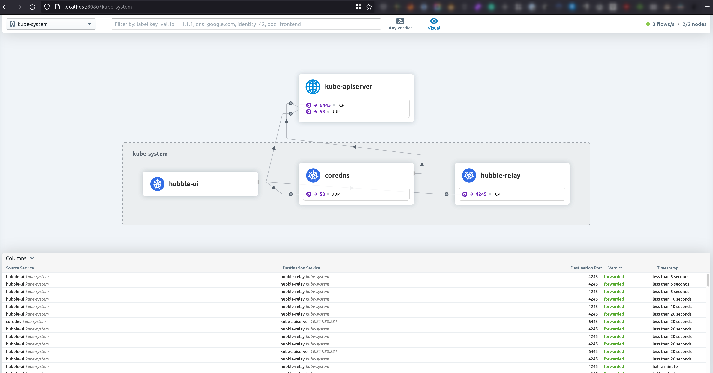

# Kubernetes The Hard Way or The Easy Way

Creates a Single Controller Kubernetes cluster using
[multipass](https://github.com/canonical/multipass)
and
[cilium](https://docs.cilium.io/en/stable/gettingstarted/k8s-install-default/#install-cilium)


Inspired and fork from

- [Project kelseyhightower/kubernetes-the-hard-way](https://github.com/kelseyhightower/kubernetes-the-hard-way)
- [Project kubernetes-the-hard-way-the-easy-way)](https://github.com/missingcharacter/kubernetes-the-hard-way-the-easy-way)
- [Create Kubernetes Trust](https://gist.github.com/detiber/81b515df272f5911959e81e39137a8bb)

All scripts are available to learn how it is built.

## Specs

- Ubuntu 22.04
- [Kubernetes 1.32.3](https://kubernetes.io/releases/)
- [etcd 3.5.21](https://github.com/etcd-io/etcd/releases)
- [containerd 1.7.27](https://github.com/containerd/containerd/releases)
- [cni plugins 1.6.2](https://github.com/containernetworking/plugins/releases)
- [cilium 1.17.2 (via helm chart)](https://github.com/cilium/cilium/releases)
- [coredns 1.39.2 (via helm chart)](https://github.com/coredns/helm/blob/master/charts/coredns/Chart.yaml)
- [Release coredns 1.12.1](https://github.com/coredns/coredns/releases)
- [nerdctl 1.7.7 (start registry and mirror)](https://github.com/containerd/nerdctl/releases)
- [Metrics server (0.7.2)](https://github.com/kubernetes-sigs/metrics-server)
- [Metrics Server Chart (3.12.2)](https://artifacthub.io/packages/helm/metrics-server/metrics-server)

## Create a dev environment

```shell
git clone --depth=1 https://github.com/bee42/cnbc-kubernetes-the-hard-way-the-easy-way.git
cd cnbc-kubernetes-the-hard-way-the-easy-way
multipass set local.driver=qemu
multipass launch --name lab-dev --cpus 2 --memory 4G --disk 20G
multipass mount $(pwd) lab-dev:/home/ubuntu/shared
multipass shell lab-dev
```

### ToDo

- [ ] Add support iximiuz labs env and multipass
  - [x] create and transfer certs
  - [ ] download files and transfer to nodes
    - [ ] extract proxy-server from containr images via crane
    - [ ] use containerd 2.x runtime -> 2.1 beta (to support image volumes)
    - [ ] use Cri-O at node-04 and crun
  - [ ] Use Kubernetes 1.33
- [x] Download all artifacts!
  - [x] Fix immutable download!
  - [ ] extract konnectivity proxy-server from docker images to setup as systemd
  - [ ] extract kube-vip to setup as systemd service
- [ ] optional multipass installation (remove from dependency ixi create vms) 
- [x] Add remove script multipass instance script
  - Add label or name prefix to instances
  - [x] teardown.sh
  - [x] manualy `multipass delete`
- [ ] Use Intermediate CA (kubenetes, ETCD, front-proxy)
- [x] Fix some certs issues
  - https://gist.github.com/detiber/81b515df272f5911959e81e39137a8bb
  - create ETCD certs
  - create Front proxy client certs
  - Kubelet client certs api-server
  - Kubelet CA
  - Kubelet TLS certs per node or one global cert
  - metrics-server - front proxy
  - RSA 2048 or other algo?
  - Rotation
  - DNSSec
- [ ] RBAC
  - admin user organisation "O" `system:masters`
  - A lot of components use this, check how kubeadm configure that
    - super-admin first leader (kube-vip) and admin?
- [ ] HA Setup
  - ETCD Communitation
  - Cluster konfig  
- [ ] CoreDNS issues
  - resolve local hostname inside cluster
  - DNS subdomain of nodes
- [ ] Create Docs
  - A journey of manually steps
  - Hints of more informations
    - Certs
    - Config components
    - checks
      - health status
    - Etcd
      - Backup/restore
      - access values
      - health status
    - resource encyption 
- [ ] Fix Metrics server tls, request handling!
  - https://kubernetes.io/docs/tasks/extend-kubernetes/configure-aggregation-layer/
- [ ] Update to containerd 2.x
  - new package content
  - new registry config
  - update nerdctl, crictl
- [ ] Update to docker mirror with creds
- [ ] Add mirror to containerd registry vm!
- [ ] Update metrics Server with TLS cert
- [ ] Add local path proviionier
- [ ] Add DevContainer
- [ ] renovate update?
- [ ] Add Cert-manager, external DNS, cloud flare tunnel
  - Add List of node hosts
- [ ] Add kubevip and HA ControlPlane
  - [ ] extract kube-vip binary
  - [ ] create a systemd service setup
  - [ ] config api server and clients (kubelet, cilium, service lb kubernetes) use the vip
- [ ] Add more
  - Headlamp
  - fluxcd
  - longhorn
  - linstor/DRDB
  - velero
  - minio
  - monitoring
    - otel
    - prometheus
    - grafana
    - victoria logs???
    - jaeger
- [ ] Update github actions pipeline
- [ ] 
- [ ] Is tls at containerd supported?
  - CRI with tls?
  ```toml
    [grpc]
    address = "/run/containerd/containerd.sock"
    tcp_address = ""
    tcp_tls_cert = ""
    tcp_tls_key = ""

  ```
## Requirements

- helm 3+
  - linux: [here](https://helm.sh/docs/intro/install/)
  - mac: `brew install helm`
- curl
  - linux: `sudo apt install curl`
  - mac: `brew install curl`
- ipcalc
  - linux: `sudo apt install ipcalc`
  - mac: `brew install ipcalc`
- [multipass](https://github.com/canonical/multipass)
  - linux: `sudo snap install multipass --classic`
  - mac: `brew cask install multipass`
- `cfssl` and `cfssljson`
  - linux:

    ```shell
    wget -q --show-progress --https-only --timestamping \
      https://storage.googleapis.com/kubernetes-the-hard-way/cfssl/linux/cfssl \
      https://storage.googleapis.com/kubernetes-the-hard-way/cfssl/linux/cfssljson
    chmod +x cfssl cfssljson
    sudo mv cfssl cfssljson /usr/local/bin/
    ```

  - mac: `brew install cfssl`
- `kubectl`
  - linux:

    ```shell
    KUBECTL_VERSION=1.32.3
    wget https://storage.googleapis.com/kubernetes-release/release/v${KUBECTL_VERSION}/bin/linux/${ARCH}/kubectl
    chmod +x kubectl
    sudo mv kubectl /usr/local/bin/
    ```

  - mac:

    ```shell
    KUBECTL_VERSION=1.32.3
    curl -o kubectl https://storage.googleapis.com/kubernetes-release/release/v${KUBECTL_VERSION}/bin/darwin/${ARCH}/kubectl
    chmod +x kubectl
    sudo mv kubectl /usr/local/bin/
    ```

## Procedure

1. Create your machines:

   ```shell
   REGISTRY_MODE=on ./setup.sh

   ./machines.sh
   ./certs.sh
   ./setup.sh
   ./config.sh
  
   ./controller.sh
  
   # check apiserver
   multipass shell controller-cnbc-k8s
   kubectl --kubeconfig admin.kubeconfig create deployment nginx --image nginx
   kubectl --kubeconfig admin.kubeconfig get deployments
   kubectl --kubeconfig admin.kubeconfig get all
   # only deployments

   # check etcd with get
    
   # check controller manager
   multipass shell controller-cnbc-k8s
   kubectl --kubeconfig admin.kubeconfig get rs
   kubectl --kubeconfig admin.kubeconfig get pods
  
   # check controller manager
   multipass shell controller-cnbc-k8s
   kubectl --kubeconfig admin.kubeconfig get rs
   kubectl --kubeconfig admin.kubeconfig get pods
   kubectl --kubeconfig admin.kubeconfig describe pods

   # check scheduler
   kubectl --kubeconfig admin.kubeconfig get nodes
   # start worker
   ./workers.sh
   
   kubectl get pods --kubeconfig /var/lib/kubelet/kubeconfig --field-selector spec.nodeName=$HOSTNAME

   ./kubelet.sh

   kubectl get pods -A
NAMESPACE   NAME                     READY   STATUS              RESTARTS   AGE
default     nginx-5869d7778c-4stv6   0/1     ContainerCreating   0          7h58m
kubectl describe pods -A
  Warning  FailedCreatePodSandBox  81s   kubelet            Failed to create pod sandbox: rpc error: code = Unknown desc = failed to setup network for sandbox "1079cbdf25bd8a164e735aa990a68b5b525f90818f56f71ed3185cd7d82d9a32": failed to find network info for sandbox "1079cbdf25bd8a164e735aa990a68b5b525f90818f56f71ed3185cd7d82d9a32"

   ./services.sh
   ```

2. Wait a couple of minutes for cilium and coredns to start working

   ```shell
   $  kubectl get all --all-namespaces
   NAMESPACE     NAME                                   READY   STATUS    RESTARTS   AGE
   kube-system   pod/cilium-25lnk                       1/1     Running   0          73s
   kube-system   pod/cilium-d8p59                       1/1     Running   0          74s
   kube-system   pod/cilium-operator-67f9b484d8-ksvzj   1/1     Running   0          74s
   kube-system   pod/cilium-operator-67f9b484d8-mqvsq   1/1     Running   0          74s
   kube-system   pod/coredns-coredns-67c645769c-klwlk   1/1     Running   0          73s
   kube-system   pod/hubble-relay-85664d47c4-ftd5n      1/1     Running   0          74s
   kube-system   pod/hubble-ui-7c6789876c-7b9mh         3/3     Running   0          74s

   NAMESPACE     NAME                      TYPE        CLUSTER-IP    EXTERNAL-IP   PORT(S)         AGE
   default       service/kubernetes        ClusterIP   172.17.0.1    <none>        443/TCP         2m31s
   kube-system   service/coredns-coredns   ClusterIP   172.17.0.10   <none>        53/UDP,53/TCP   73s
   kube-system   service/hubble-relay      ClusterIP   172.17.0.83   <none>        80/TCP          74s
   kube-system   service/hubble-ui         ClusterIP   172.17.0.35   <none>        80/TCP          74s

   NAMESPACE     NAME                    DESIRED   CURRENT   READY   UP-TO-DATE   AVAILABLE   NODE SELECTOR   AGE
   kube-system   daemonset.apps/cilium   2         2         2       2            2           <none>          74s

   NAMESPACE     NAME                              READY   UP-TO-DATE   AVAILABLE   AGE
   kube-system   deployment.apps/cilium-operator   2/2     2            2           74s
   kube-system   deployment.apps/coredns-coredns   1/1     1            1           73s
   kube-system   deployment.apps/hubble-relay      1/1     1            1           74s
   kube-system   deployment.apps/hubble-ui         1/1     1            1           74s

   NAMESPACE     NAME                                         DESIRED   CURRENT   READY   AGE
   kube-system   replicaset.apps/cilium-operator-67f9b484d8   2         2         2       74s
   kube-system   replicaset.apps/coredns-coredns-67c645769c   1         1         1       73s
   kube-system   replicaset.apps/hubble-relay-85664d47c4      1         1         1       74s
   kube-system   replicaset.apps/hubble-ui-7c6789876c         1         1         1       74s
   ```

3. Your cluster is ready, lets verify data encryption works

   ```shell
   $ kubectl create secret \
     generic kubernetes-the-hard-way --from-literal="mykey=mydata"
   $ multipass exec controller-k8s -- sudo ETCDCTL_API=3 etcdctl get \
     --endpoints=https://127.0.0.1:2379 --cacert=/etc/etcd/ca.pem \
     --cert=/etc/etcd/kubernetes.pem --key=/etc/etcd/kubernetes-key.pem \
     /registry/secrets/default/kubernetes-the-hard-way | hexdump -C
   00000000  2f 72 65 67 69 73 74 72  79 2f 73 65 63 72 65 74  |/registry/secret|
   00000010  73 2f 64 65 66 61 75 6c  74 2f 6b 75 62 65 72 6e  |s/default/kubern|
   00000020  65 74 65 73 2d 74 68 65  2d 68 61 72 64 2d 77 61  |etes-the-hard-wa|
   00000030  79 0a 6b 38 73 3a 65 6e  63 3a 61 65 73 63 62 63  |y.k8s:enc:aescbc|
   00000040  3a 76 31 3a 6b 65 79 31  3a 61 bb c0 45 f2 df 88  |:v1:cnbc:a..E...|
   00000050  36 46 05 df c1 df 26 e1  e0 59 18 9f 7d 51 7a d9  |6F....&..Y..}Qz.|
   00000060  28 0d 03 4e c3 14 55 01  51 d6 aa cc 50 21 a5 09  |(..N..U.Q...P!..|
   00000070  86 92 89 9b 33 82 43 09  7d 5b fe bb 68 45 43 48  |....3.C.}[..hECH|
   00000080  96 9a 1e a8 88 30 82 a8  2c d8 26 ea 12 19 58 da  |.....0..,.&...X.|
   00000090  3a 25 ed 6b 47 1f e2 e9  31 91 e6 cf 64 bb 19 41  |:%.kG...1...d..A|
   000000a0  fe 2b 7a 86 a8 be e4 c0  b6 98 2e dc 96 92 58 92  |.+z...........X.|
   000000b0  c4 6b c1 85 a9 d0 ec d6  03 2d c7 2c 14 f5 da 03  |.k.......-.,....|
   000000c0  ef c6 c9 2b bc 26 9c 36  ab 0c da 08 f2 8b 79 c7  |...+.&.6......y.|
   000000d0  12 98 55 5f 4c 56 f7 fd  e1 71 45 16 a3 59 01 76  |..U_LV...qE..Y.v|
   000000e0  97 5b d1 cc 91 92 c5 d9  05 0a                    |.[........|
   000000ea
   ```

   The etcd key should be prefixed with `k8s:enc:aescbc:v1:cnbc`, which
   indicates the `aescbc` provider was used to encrypt the data with the `key1`
   encryption key.

4. [Deployments](https://github.com/kelseyhightower/kubernetes-the-hard-way/blob/master/docs/13-smoke-test.md#deployments)
   as they are described on Kubernetes the hard way will work

   ```shell
   $ kubectl create deployment nginx --image=nginx
   deployment.apps/nginx created
   ```

   List the pod created

   ```shell
   $ kubectl get pods -l app=nginx
   NAME                    READY   STATUS    RESTARTS   AGE
   nginx-8f458dc5b-86vs4   1/1     Running   0          36s
   ```

5. NodePort service will work in the following way (Depends on `nginx`
   deployment described in step 4)

   ```shell
   $ kubectl expose deployment nginx --port 80 --type NodePort
   $ NODE_PORT=$(kubectl get svc nginx \
     --output=jsonpath='{range .spec.ports[0]}{.nodePort}')
   $ WORKER_IP=$(multipass info 'worker-1-k8s' | grep 'IPv4' | \
     awk '{ print $2 }')
   $ curl -I "http://${WORKER_IP}:${NODE_PORT}"
   HTTP/1.1 200 OK
   Server: nginx/1.27.1
   Date: Thu, 07 Dec 2023 05:28:35 GMT
   Content-Type: text/html
   Content-Length: 615
   Last-Modified: Tue, 24 Oct 2023 13:46:47 GMT
   Connection: keep-alive
   ETag: "6537cac7-267"
   Accept-Ranges: bytes
   ```

6. You've done a kubernetes!

## How to see hubble-ui

1. Forward hubble-ui port

   ```shell
   POD_NAME=$(kubectl get pods -n kube-system -l k8s-app=hubble-ui \
     -o jsonpath="{.items[0].metadata.name}")
   kubectl port-forward -n kube-system ${POD_NAME} 8080:8081
   ```

2. In your browser go to
   [http://localhost:8080](http://localhost:8080)
   -> pick a namespace with pods. Example below:

   

## Metrics server with tls

References:

- https://ftclausen.github.io/infra/setting_up_k8s_with_metrics_server/
- https://kubernetes.io/docs/tasks/extend-kubernetes/configure-aggregation-layer/#authentication-flow
- [Metrics Server Design](https://kubernetes.io/docs/tasks/debug/debug-cluster/resource-metrics-pipeline/)
- [APIServer Metrics client](https://github.com/kubernetes/metrics)
- [Prometheus Custom Metrics](https://github.com/kubernetes-sigs/prometheus-adapter)

Questions:

- How generate the metrics-server certs? signed by front-proxy.ca?
- client adnd requestHeader ca normaly not the same?
- API-Service use the internal cluster service IP
  - Controlplane has no access to this network!
  - Disable metrics server
  - Create a Loadbalancer Service IP
Example:

```text
 /metrics-server
  --cert-dir=/var/lib/kubernetes
  --client-ca-file=/var/lib/kubernetes/requestheader-client-ca.crt
  --kubelet-certificate-authority=/var/lib/kubernetes/ca.pem
  --requestheader-allowed-names=""
  --requestheader-client-ca-file=/var/lib/kubernetes/requestheader-client-ca.crt
  --tls-cert-file=/var/lib/kubernetes/metrics-server.pem
  --tls-private-key-file=/var/lib/kubernetes/metrics-server-key.pem
  --requestheader-extra-headers-prefix=X-Remote-Extra-
  --requestheader-group-headers=X-Remote-Group
  --requestheader-username-headers=X-Remote-User
  --logtostderr
  --v=5
  --secure-port=8443
```

```shell
kubectl -n kube-system create secret tls metrics-proxy \
  --from-file ca.crt=00-certificate/00-Certificate-Authority/kubernetes-front-proxy-ca.pem \
  --from-file tls.crt=00-certificate/00-Certificate-Authority/front-proxy-client.pem \
  --from-file tls.key=00-certificate/00-Certificate-Authority/front-proxy-client-key.pem

  --tls-private-key-file=/var/lib/kubernetes/kubernetes-key.pem \\
  --proxy-client-cert-file=/var/lib/kubernetes/front-proxy-client.pem \\
  --proxy-client-key-file=/var/lib/kubernetes/front-proxy-client-key.pem \\
  --requestheader-allowed-names=front-proxy-client \\
  --requestheader-client-ca-file=/var/lib/kubernetes/kubernetes-front-proxy-ca.pem \\
```

```shell
# access containerLogs
curl \
  --cert ./00-certificates/10-kubelet-server/apiserver-kubelet-client.pem \
  --key ./00-certificates/10-kubelet-server/apiserver-kubelet-client-key.pem \
  --cacert ./00-certificates/00-Certificate-Authority/kubelet-ca/kubelet-ca.pem \
  https://192.168.64.20:10250/containerLogs/kube-system/metrics-server-6cb874ffbc-wjsgn/metrics-server

# get metrics
curl \
  --cert ./00-certificates/10-kubelet-serveri/apiserver-kubelet-client.pem \
  --key ./00-certificates/10-kubelet-server/apiserver-kubelet-client-key.pem \
  --cacert ./00-certificates/00-Certificate-Authority/kubelet-ca/kubelet-ca.pem \
  https://192.168.64.20:10250/metrics/resource
```

## konnectivity apiserver -> proxy tunnel to services

- [setup-konnectivity](https://kubernetes.io/docs/tasks/extend-kubernetes/setup-konnectivity/)
- [apiserver-network-proxy](https://github.com/kubernetes-sigs/apiserver-network-proxy)
- [network-proxy proposal](https://github.com/kubernetes/enhancements/tree/master/keps/sig-api-machinery/1281-network-proxy#proposal)

```text
Frontend client =HTTP over GRPC+UDS=> (/tmp/uds-proxy) proxy (:8091) <=GRPC= agent =HTTP=> SimpleHTTPServer(:8000)
  |                                                                            ^
  |                                     Tunnel                                 |
  +----------------------------------------------------------------------------+
```

Detected version:

```shell
# development:
skopeo list-tags docker://gcr.io/k8s-staging-kas-network-proxy/proxy-server
docker manifest inspect gcr.io/k8s-staging-kas-network-proxy/proxy-server:release-0.32
# multiarch

# Release:
skopeo list-tags docker://registry.k8s.io/kas-network-proxy/proxy-server
skopeo list-tags docker://registry.k8s.io/kas-network-proxy/proxy-agent
docker manifest inspect registry.k8s.io/kas-network-proxy/proxy-server:v0.32.0

docker container export $(docker container create --name proxy-server registry.k8s.io/kas-network-proxy/proxy-server:v0.32.0) -o proxyserver-0.32.0.tar
tar -xvf  proxyserver-0.32.0.tar proxy-server
multipass transfer proxy-server controller-cnbc-k8s:/home/ubuntu
multipass exec controller-cnbc-k8s sudo mv proxy-server /usr/local/bin
rm proxyserver-0.32.0.tar
docker container rm proxy-server

# multiarch
```


If you prefer a lighter and script-friendly way:

1. Download and extract the image filesystem:

```shell
crane export registry.k8s.io/kas-network-proxy/proxy-server:v0.32.0 proxyserver-0.32.0.tar
```

2. Extract the tar to get the container filesystem:

```shell
tar -xvf proxyserver-0.32.0.tar proxy-server
```

Note: crane export is equivalent to docker export in behavior — it gives you the filesystem of the container image.

## Coredns

- https://coredns.io/explugins/kubenodes/

coredns config map:

```yaml
apiVersion: v1
data:
  Corefile: |-
    .:53 {
        errors
        health {
            lameduck 10s
        }
        ready
        kubernetes cluster.local in-addr.arpa ip6.arpa {
            pods insecure
            fallthrough in-addr.arpa ip6.arpa
            ttl 30
        }
        prometheus 0.0.0.0:9153
        hosts /etc/coredns/NodeHosts {
          ttl 60
          reload 15s
          fallthrough
        }
        forward . /etc/resolv.conf
        cache 30
        loop
        reload
        loadbalance
    }
  NodeHosts: |
    192.168.64.18   controller-cnbc-k8s
    192.168.64.19   worker-1-cnbc-k8s
    192.168.64.20   worker-2-cnbc-k8s
    192.168.64.2    cnbc-mirror cnbc-registry
kind: ConfigMap
metadata:
  annotations:
    meta.helm.sh/release-name: coredns
    meta.helm.sh/release-namespace: kube-system
  labels:
    app.kubernetes.io/instance: coredns
    app.kubernetes.io/managed-by: Helm
    app.kubernetes.io/name: coredns
    helm.sh/chart: coredns-1.39.2
    k8s-app: coredns
    kubernetes.io/cluster-service: "true"
    kubernetes.io/name: CoreDNS
  name: coredns
  namespace: kube-system
```

Mount complete configmap not only coredns item:

```yaml
apiVersion: apps/v1
kind: Deployment
metadata:
  annotations:
    deployment.kubernetes.io/revision: "4"
    meta.helm.sh/release-name: coredns
    meta.helm.sh/release-namespace: kube-system
  labels:
    app.kubernetes.io/instance: coredns
    app.kubernetes.io/managed-by: Helm
    app.kubernetes.io/name: coredns
    app.kubernetes.io/version: 1.12.0
    helm.sh/chart: coredns-1.39.2
    k8s-app: coredns
    kubernetes.io/cluster-service: "true"
    kubernetes.io/name: CoreDNS
  name: coredns
  namespace: kube-system
spec:
  progressDeadlineSeconds: 600
  replicas: 1
  revisionHistoryLimit: 10
  selector:
    matchLabels:
      app.kubernetes.io/instance: coredns
      app.kubernetes.io/name: coredns
      k8s-app: coredns
  strategy:
    rollingUpdate:
      maxSurge: 25%
      maxUnavailable: 1
    type: RollingUpdate
  template:
    metadata:
      annotations:
        checksum/config: 8cb9897670e902ce3724b29e54e1a051f4a6ad237c87634ee3c2cbc4215415e6
        kubectl.kubernetes.io/restartedAt: "2025-04-22T09:02:08+02:00"
        scheduler.alpha.kubernetes.io/tolerations: '[{"key":"CriticalAddonsOnly",
          "operator":"Exists"}]'
      creationTimestamp: null
      labels:
        app.kubernetes.io/instance: coredns
        app.kubernetes.io/name: coredns
        k8s-app: coredns
    spec:
      containers:
      - args:
        - -conf
        - /etc/coredns/Corefile
        image: coredns/coredns:1.12.0
        imagePullPolicy: IfNotPresent
        livenessProbe:
          failureThreshold: 5
          httpGet:
            path: /health
            port: 8080
            scheme: HTTP
          initialDelaySeconds: 60
          periodSeconds: 10
          successThreshold: 1
          timeoutSeconds: 5
        name: coredns
        ports:
        - containerPort: 53
          name: udp-53
          protocol: UDP
        - containerPort: 53
          name: tcp-53
          protocol: TCP
        - containerPort: 9153
          name: tcp-9153
          protocol: TCP
        readinessProbe:
          failureThreshold: 1
          httpGet:
            path: /ready
            port: 8181
            scheme: HTTP
          initialDelaySeconds: 30
          periodSeconds: 5
          successThreshold: 1
          timeoutSeconds: 5
        resources:
          limits:
            cpu: 100m
            memory: 128Mi
          requests:
            cpu: 100m
            memory: 128Mi
        securityContext:
          allowPrivilegeEscalation: false
          capabilities:
            add:
            - NET_BIND_SERVICE
            drop:
            - ALL
          readOnlyRootFilesystem: true
        terminationMessagePath: /dev/termination-log
        terminationMessagePolicy: File
        volumeMounts:
        - mountPath: /etc/coredns
          name: config-volume
      dnsPolicy: Default
      restartPolicy: Always
      schedulerName: default-scheduler
      serviceAccount: default
      serviceAccountName: default
      terminationGracePeriodSeconds: 30
      volumes:
      - configMap:
          defaultMode: 420
          name: coredns
        name: config-volume
```

## kube-vip

kube-vip provides both a floating or virtual IP address for your kubernetes cluster as well as load-balancing the incoming traffic to various control-plane replicas. 

Extract kube-vip binary

```shell
KUBE_VIP_VERSION=0.9.0
docker container export $(docker container create --name kube-vip ghcr.io/kube-vip/kube-vip:v${KUBE_VIP_VERSION}) -o kube-vip-${KUBE_VIP_VERSION}.tar
tar -xvf kube-vip-${KUBE_VIP_VERSION}.tar kube-vip
multipass transfer kube-vip controller-cnbc-k8s:/home/ubuntu
multipass exec controller-cnbc-k8s sudo mv kube-vip /usr/local/bin
rm kube-vip-${KUBE_VIP_VERSION}.tar
docker container rm kube-vip
```

```text
[Unit]
Description=Kube-VIP - Virtual IP for Kubernetes Control Plane
After=network.target
Wants=network-online.target

[Service]
Type=simple
ExecStart=/usr/local/bin/kube-vip manager \
    --interface enp0s1 \
    --address 192.168.64.254 \
    --vip-cidr 32 \
    --arp \
    --k8sConfigPath /var/lib/kuberentes/admin.kubeconfig \
    --controlplane \
    --namespace kube-system \
    --services \
    --leaderElection \
    --leaseDuration 5 \
    --renewDeadline 3 \
    --retryPeriod 1 \
    --port 6443
Restart=always
RestartSec=5

# Needed for VIP management
CapabilityBoundingSet=CAP_NET_ADMIN CAP_NET_RAW CAP_SYS_TIME
AmbientCapabilities=CAP_NET_ADMIN CAP_NET_RAW CAP_SYS_TIME
ExecReload=/bin/kill -HUP $MAINPID

[Install]
WantedBy=multi-user.target
````

## ETCD

Health Check Certs?

* https://etcd.io/docs/v3.5/tutorials/how-to-check-cluster-status/

```shell
etcdctl endpoint status (--endpoints=$ENDPOINTS|--cluster)

etcdctl  endpoint health --cacert /var/lib/kubernetes/kubernetes-ca.pem --cert /var/lib/kubernetes/kubernetes.pem --key /var/lib/kubernetes/kubernetes-key.pem https://192.168.64.15:2379
```

### Access data

- [Access ETCD](https://medium.com/@bala.praveenkumar/understanding-the-workflow-how-kubernetes-uses-etcd-to-store-and-manage-cluster-information-2196355a5422)
- [Play jq](https://play.jqlang.org)

```shell
kubeclt --kubeconfig admin.kubeconfig create deployment nginx --image=nginx

sudo ETCDCTL_API=3 etcdctl  --cacert /var/lib/kubernetes/etcd-ca.pem \
  --cert /var/lib/kubernetes/apiserver-etcd-client.pem \
  --key /var/lib/kubernetes/apiserver-etcd-client-key.pem \
  --endpoints=https://192.168.64.18:2379 \
  get / --prefix --keys-only 

sudo apt install -y jq
sudo ETCDCTL_API=3 etcdctl  --cacert /var/lib/kubernetes/etcd-ca.pem \
  --cert /var/lib/kubernetes/apiserver-etcd-client.pem \
  --key /var/lib/kubernetes/apiserver-etcd-client-key.pem \
  --endpoints=https://192.168.64.18:2379 \
  get /registry/deployments/default/nginx -w json | jq -r '
  .kvs[] |
  {key: (.key | @base64d), value: (.value | @base64d)}
'
```

## Teardown the hard way instances

```shell
./teardown.sh
multipass list --format json | jq '(.list[] | select(.name | contains("cnbc-k8s"))) | .name'
multipass purge
```

## Troubleshooting

### All nodes should be able to reach each other via hostname

`01-config-files/distribute-config-files.sh` generates multipass-hosts and
later the bootstrap scripts append it to `/etc/hosts` on the controllers and
workers

### Cilium

- [Cilium Docs](https://docs.cilium.io/en/stable/operations/system_requirements/#admin-system-reqs)

```shell
mount bpffs /sys/fs/bpf -t bpf
```

### multipass

- [Multipass Completion](https://gist.github.com/linux-china/3e1a7ce99393382ad8fe575af19c8f07)
- https://github.com/linux-china/cli-completion

```shell
curl -Ls -o multipass_completion.zsh \
https://gist.githubusercontent.com/linux-china/3e1a7ce99393382ad8fe575af19c8f07/raw/09b65ff2615c3c4f279653e3715f87f4f7ee2a75/multipass_completion.zsh
mkdir ~/.oh-my-zsh/custom/plugins/multipass
cp multipass_completion.zsh ~/.oh-my-zsh/custom/plugins/multipass/_multipass
```

### tls

Can't access Kubelet from metrics server:
- create only client certs for worker!

```shell
# tls verification error
openssl s_client -showcerts -connect 192.168.64.20:10250
Connecting to 192.168.64.20
CONNECTED(00000003)
Can't use SSL_get_servername
depth=0 C=DE, ST=NRW, L=Bochum, O=system:nodes, OU=Kubernetes The Hard Way, CN=system:node:worker-2-cnbc-k8s
verify error:num=20:unable to get local issuer certificate
verify return:1
depth=0 C=DE, ST=NRW, L=Bochum, O=system:nodes, OU=Kubernetes The Hard Way, CN=system:node:worker-2-cnbc-k8s
verify error:num=26:unsuitable certificate purpose
verify return:1
depth=0 C=DE, ST=NRW, L=Bochum, O=system:nodes, OU=Kubernetes The Hard Way, CN=system:node:worker-2-cnbc-k8s
verify error:num=21:unable to verify the first certificate
verify return:1
depth=0 C=DE, ST=NRW, L=Bochum, O=system:nodes, OU=Kubernetes The Hard Way, CN=system:node:worker-2-cnbc-k8s
verify return:1

curl -vv \                                                  
  --cert ./00-certificates/06-kubernetes-api/apiserver-kubelet-client.pem \
  --key ./00-certificates/06-kubernetes-api/apiserver-kubelet-client-key.pem \
  --cacert ./00-certificates/00-Certificate-Authority/kubernetes-ca.pem \
  https://192.168.64.20:10250/containerLogs/kube-system/metrics-server-6cb874ffbc-wjsgn/metrics-server
* SSL certificate problem: unsupported certificate purpose
* Closing connection
curl: (60) SSL certificate problem: unsupported certificate purpose
More details here: https://curl.se/docs/sslcerts.html

kubectl describe apiservice v1beta1.metrics.k8s.io
    Message:               failing or missing response from https://172.17.0.210:443/apis/metrics.k8s.io/v1beta1: Get "https://172.17.0.210:443/apis/metrics.k8s.io/v1beta1": context deadline exceeded
    Reason:                FailedDiscoveryCheck
kubectl get --raw "/apis/metrics.k8s.io/v1beta1/nodes"
Error from server (ServiceUnavailable): the server is currently unable to handle the request
kubectl get endpoints metrics-server -n kube-system
```

```shell
# access...
curl -ik https://192.168.64.18:6443/apis/metrics.k8s.io/v1beta1/nodes \
  --cert ./00-certificates/08-front-proxy-client/front-proxy-client.pem \
  --key ./00-certificates/08-front-proxy-client/front-proxy-client-key.pem \
  --cacert ./00-certificates/00-Certificate-Authority/front-proxy-client-ca.pem \
  -H 'X-Remote-User: system:kube-aggregator' \
  -H 'X-Remote-Group: system:masters'

# get prometheus metrics
curl -ik https://192.168.64.20:10250/metrics \
  --cert ./00-certificates/06-kubernetes-api/apiserver-kubelet-client.pem \
  --key ./00-certificates/06-kubernetes-api/apiserver-kubelet-client-key.pem \
  --cacert ./00-certificates/00-Certificate-Authority/kubernetes-ca.pem \
  -H 'X-Remote-User: system:kube-aggregator' \
  -H 'X-Remote-Group: system:masters'
```

API:

- /apis/metrics.k8s.io/v1beta1/pods
- /apis/metrics.k8s.io/v1beta1/namespaces/{namespace}/pods
- /apis/metrics.k8s.io/v1beta1/namespaces/{namespace}/pods/{name}
- /apis/metrics.k8s.io/v1beta1/nodes
- /apis/metrics.k8s.io/v1beta1/nodes/{name}

ControlPlane to Cluster Service Communication

- https://kubernetes.io/docs/concepts/architecture/control-plane-node-communication/#control-plane-to-node

## implement checks


| Component           | Default Port | Protocol | Description                    |
|---------------------|--------------|----------|--------------------------------|
| kube-apiserver      | 6443         | HTTPS    | Main API server port           |
| etcd                | 2379-2380    | HTTPS    | etcd client/server             |
| kube-scheduler      | 10259        | HTTPS    | Metrics & healthz (local only) |
| kube-controller     | 10257        | HTTPS    | Metrics & healthz (local only) |
| kubelet (worker)    | 10250        | HTTPS    | API to kubelet (on each node)  |
| kube-proxy          | 10256        | HTTP     | Metrics                        |
| konnectivity-server | 8091         | HTTPS    | server                         |
| konnectivity-server | 8092         | HTTPS    | admin                          |
| konnectivity-server | 9093         | HTTPS    | healthz                        |


Check Ports

```shell
sudo lsof -i -P -n | grep LISTEN
sudo netstat -tulpn | grep LISTEN

# control plane check
# api-server, etcd, controller-manager, scheduler, konnectivit agent
# controller and scheduler localhost only?
sudo ss -tuln | grep -E '(:6443|:2379|:2380|:10259|:10257|:10250|:8091|:8092|:8093)'

# worker kubelet and kube-proxy
sudo ss -tuln | grep -E '(:10250|:10256)'

# cilium at worker
```

## Kublet to Container Runtime Interface (CRI) are doesn't mTLS safe?

Here's a more detailed breakdown:

### Kubelet-API Server Communication:

The Kubelet needs TLS certificates to authenticate and authorize its communication with the Kubernetes API server. This is essential for tasks like registering the node, fetching pod specifications, and reporting node status. 

### CRI Communication:

The Kubelet uses the Container Runtime Interface (CRI) to interact with the container runtime (e.g., containerd, Docker) running on the node. While gRPC connections between the Kubelet and CRI can use TLS, it's not a strict requirement for basic functionality. 

### TLS Bootstrapping:

Kubernetes uses a process called TLS bootstrapping to ensure the Kubelet has a valid client certificate for communicating with the API server. This involves the Kubelet initially connecting to the API server using a bootstrap token, requesting a certificate signing request (CSR), and then the API server issuing and delivering a certificate to the Kubelet. 

### Why not CRI-specific TLS?

The Kubelet's primary focus is on secure communication with the API server, which is crucial for cluster management and control. The CRI is more of a backend implementation detail for the kubelet, and while TLS is a common security practice, the Kubelet's configuration and certificates are geared towards API server communication. 

### Example

Yes, the communication between the kubelet and the Container Runtime Interface (CRI) can be secured using TLS. By default, Kubernetes employs gRPC over Unix domain sockets for this interaction, which inherently provides a level of security through operating system permissions. However, when the kubelet communicates with the container runtime over TCP, implementing TLS is essential to ensure secure communication.​

#### Enabling TLS Between Kubelet and CRI

To secure the communication between the kubelet and the container runtime over TCP using TLS, both components must be configured appropriately:​

1. Kubelet Configuration:

The kubelet can be configured to use TLS when connecting to the container runtime by specifying the appropriate flags or configuration options:​

- `--container-runtime-endpoint`: Set this to the secure endpoint of the container runtime, e.g., tcp://127.0.0.1:1234.​
- `--image-service-endpoint`: If the image service uses a different endpoint, specify it similarly.​
Kubernetes

- `--tls-cert-file` and `--tls-private-key-file`: Provide the paths to the TLS certificate and private key files for the kubelet.​
 `--tls-ca-file`: Specify the path to the Certificate Authority (CA) certificate to verify the container runtime's certificate.​

Alternatively, these settings can be specified in the kubelet's configuration file (kubelet-config.yaml) under the authentication and authorization sections.​

2. Container Runtime Configuration:

The container runtime must be configured to accept secure connections:​

- containerd: In the config.toml file, under the [plugins."io.containerd.grpc.v1.cri"] section, set the endpoint to a secure listener, e.g., tcp://127.0.0.1:1234. Additionally, specify the TLS certificate, key, and CA files to enable TLS. ​
- CRI-O: Similar configurations can be applied in CRI-O's configuration files to enable TLS for its gRPC endpoints.​

#### Considerations

- Unix Domain Sockets vs. TCP: While Unix domain sockets are secure through file system permissions and are commonly used for local communication, using TCP with TLS is necessary when the kubelet and container runtime are on different hosts or when additional security is required.​
- Certificate Management: Proper management of TLS certificates is crucial. Ensure that certificates are signed by a trusted CA and are rotated regularly to maintain security.​
- Performance: Enabling TLS may introduce slight performance overhead due to encryption and decryption processes. Evaluate the impact based on your cluster's requirements.​

By configuring both the kubelet and the container runtime to use TLS over TCP, you can secure their communication, protecting against potential eavesdropping or man-in-the-middle attacks.​

## Challenges of Day 2 Operations

- Rotation of TLS certs of kubernetes componentes
  - CA Rotation
- backup and restore etcd database
- Metrics, Logs and alerts
- Setup CNI
- Security
  - Image CVE, Signature
  - Kyverno only AirCap Repositories
- CVE Status of systems?
- Updates
  - OS
  - Kubernetes
  - Containerd
- flux 
- renovate
  - Dependency Update
- add services
  - cert-Managaer
  - external-dns
  - external secret manager
  - storage
- tls bootstraping kublet
  - https://kubernetes.io/docs/reference/access-authn-authz/kubelet-tls-bootstrapping/

## FAQ

- Why kube-proxy is needed at worker nodes?
  - [Cilium without KubeProxy](https://docs.cilium.io/en/stable/network/kubernetes/kubeproxy-free/)
  - isn't needed
  - use L2 setup the 05-networking and disable kube-proxy setup at worker!
- Start a registry and mirror to start deplopment
  - start with nerdctl compose up :)
- Why all certs starts with the ca-config...
  - missing kube-scheduler 10259 client-server cert
    - `--tls-cert-file string`
    - `--tls-private-key`
    - better allow only localhost access
      - `--bind-address string     Default: 0.0.0.0`
- Start fluxcd to create a PAAS
  - simple git-server
  - external DNS + core dns + internal etcd
  - Cert Manager + intermediated CA
  - use cilium ingress
  - metrics server
  - CSI NFS Storage Provisioner
- Test HA Setup with kube-vip
  - Multiple Contoller
  - API Server VIP
  - kube-vip
- Backup
  - etcd database
  - velero
- Buildkitd server
- Registry with TLS Cert and AUTH
  - Harbor
  - Helm Chart
- Setup a CI Testing System
  - MACOS - Parallels VM?
  - Ubuntu + Micro VM's
  - Build at your own Hardware
- Gitlab/CI vs github actions

## Related links

- [multipass /etc/hosts](https://github.com/canonical/multipass/issues/853#issuecomment-630097263)
- [Kubernetes HA with kubeadm](https://kubernetes.io/docs/setup/production-environment/tools/kubeadm/high-availability/)
- [CNI Network with Cilium](https://cilium.io)
- [Kubernetes-Tutorials](https://github.com/Albertchong/Kubernetes-Tutorials/)

Regards,

[`├─☺︎─┤` The humbled paint signer - Peter Rossbach](mailto://peter.rossbach@bee42.com)
